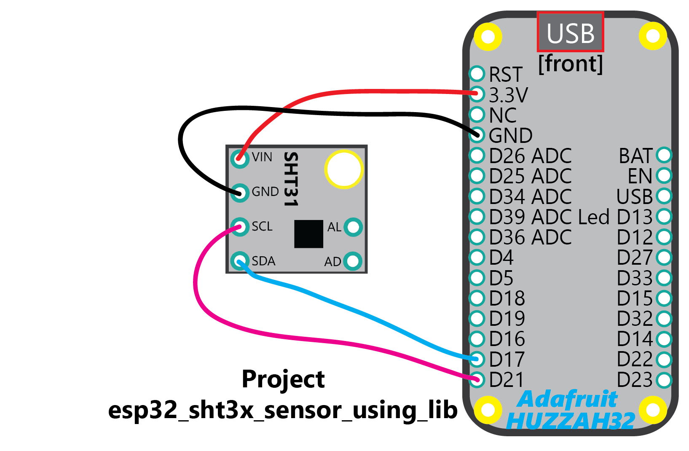

## Project Description
This project demonstrates the basics of using the MJD ESP-IDF component "mjd_sht3x" for the ESP32 and the popular breakout boards of the **Sensirion SHT3x Relative Humidity and Temperature Sensor** using the **I2C Bus**.

Go to the component directory "**components/mjd_sht3x**" for more documentation, suggested breakout boards (if relevant), installation and wiring instructions, data sheets, FAQ, photo's, etc.


## Lab Setup

The idea is to report in a loop the individual output metrics (**temperature C F, relative humidity %, dew point C F**) of the SHT3x sensor and report in summary **the average, minimum and maximum**.

The hardware setup consists of an ESP32 development board (Adafruit HUZZAH32 or similar), a SHT31 breakout module.


## Wiring Diagram
```
SHT31 PIN LAYOUT:

PIN#      PIN NAME	 Description
--------  ---------- -----------
 Left 1   VIN        Power supply (3.3V for the ESP32)
 Left 2   GND        Ground
 Left 3   SCL        I2C Serial Clock
 Left 4   SAA/SDA    I2C Serial Data
 Right 1  AL         Alert pin
 Right 2  AD         I2C Address pin
```



```
WIRING DIAGRAM: MCU - SHT3X:

SHT3X PIN    MCU PIN
-----------  -------
VIN          VCC 3.3V
GND          GND
SCL          21
SDA          17
AL           --
AD           --
```


## Running the example

- Run `make menuconfig` and review/modify the section "MY PROJECT CONFIGURATION": the GPIO PIN#'s for I2C and the property Repeatability (High, Medium, Low).
  @tip You can also change the log level in Components->Logging: use level INFO for normal operation, use level DEBUG for more detailed logging and to get insights in what the component is actually doing.
- Run `make flash monitor` to build and upload the example to your board and connect to its serial terminal.


## An extract of the UART Debugging Output

```
...
I myapp: do mjd_sht3x_init()
I mjd_sht3x: SHT3X Log Device Params (*Read again from registers*):
I mjd_sht3x:   alert_pending_status:       0x0 0b00000000 (0)
I mjd_sht3x:   heater_status:              0x0 0b00000000 (0)
I mjd_sht3x:   rh_tracking_alert:          0x0 0b00000000 (0)
I mjd_sht3x:   t_tracking_alert:           0x0 0b00000000 (0)
I mjd_sht3x:   system_reset_detected:      0x0 0b00000000 (0)
I mjd_sht3x:   last_command_status:        0x0 0b00000000 (0)
I mjd_sht3x:   write_data_checksum_status: 0x0 0b00000000 (0)
I mjd: *** 19700101000002 Thu Jan  1 00:00:02 1970
I myapp: LOOP: NBR_OF_RUNS 10
I myapp:   ***SHT3X MEAS#1***
I myapp:     RelHum:  44.460 | Temp C:  24.877 | Temp F:  76.779 | DewPoint C:  11.943
I myapp:   ***SHT3X MEAS#2***
I myapp:     RelHum:  44.479 | Temp C:  24.864 | Temp F:  76.755 | DewPoint C:  11.937
I myapp:   ***SHT3X MEAS#3***
I myapp:     RelHum:  44.434 | Temp C:  24.877 | Temp F:  76.779 | DewPoint C:  11.934
. . .
. . .
I myapp:   ***SHT3X MEAS#10***
I myapp:     RelHum:  44.411 | Temp C:  24.864 | Temp F:  76.755 | DewPoint C:  11.914
I myapp: REPORT:
I myapp:   NBR_OF_RUNS:   10
I myapp:   nbr_of_errors: 0
I myapp:     METRIC                        avg        min        max
I myapp:     ------                 ---------- ---------- ----------
I myapp:     Relative Humidity          44.428     44.343     44.524
I myapp:     Temperature Celsius        24.862     24.821     24.891
I myapp:     Temperature Fahrenheit     76.751     76.678     76.803
I myapp:     Dew Point Celsius          11.918     11.852     11.965
I mjd: *** 19700101000002 Thu Jan  1 00:00:02 1970
/
```


## Reference: the ESP32 MJD Starter Kit SDK

Do you also want to create innovative IoT projects that use the ESP32 chip, or ESP32-based modules, of the popular company Espressif? Well, I did and still do. And I hope you do too.

The objective of this well documented Starter Kit is to accelerate the development of your IoT projects for ESP32 hardware using the ESP-IDF framework from Espressif and get inspired what kind of apps you can build for ESP32 using various hardware modules.

Go to https://github.com/pantaluna/esp32-mjd-starter-kit


